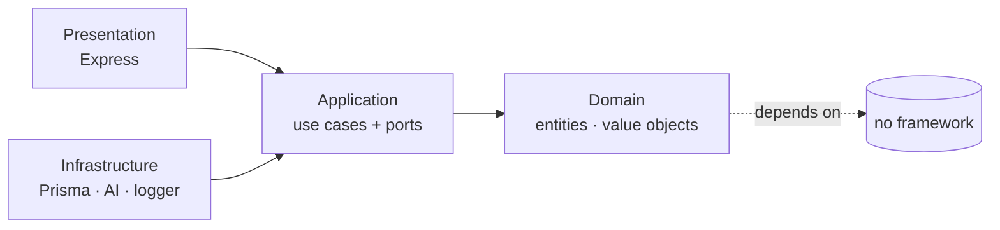
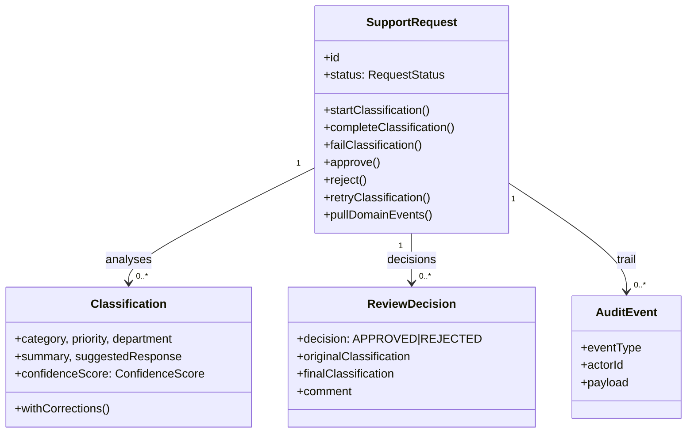
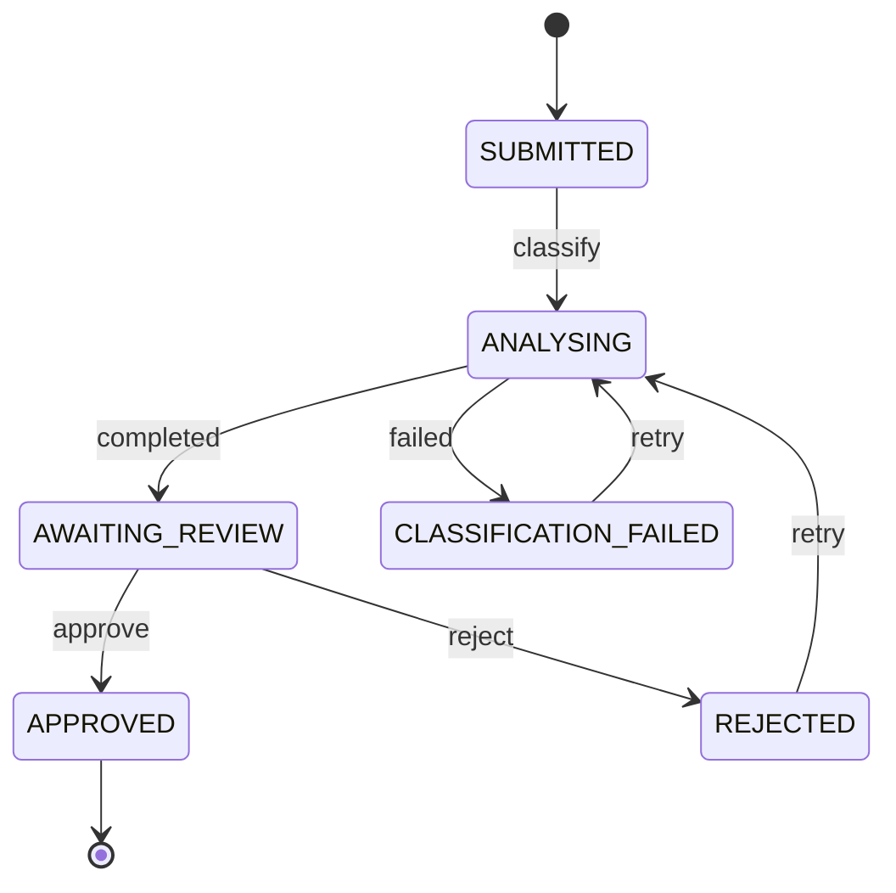
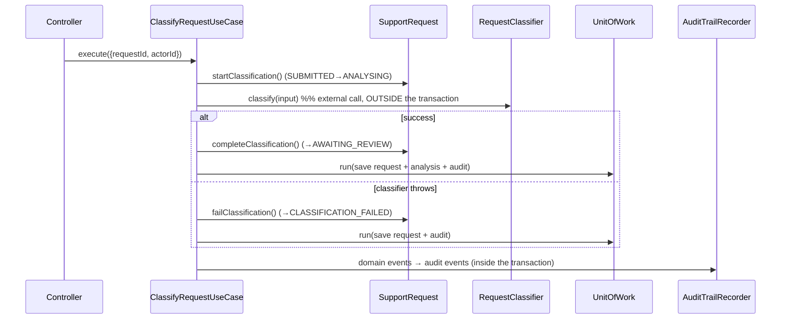
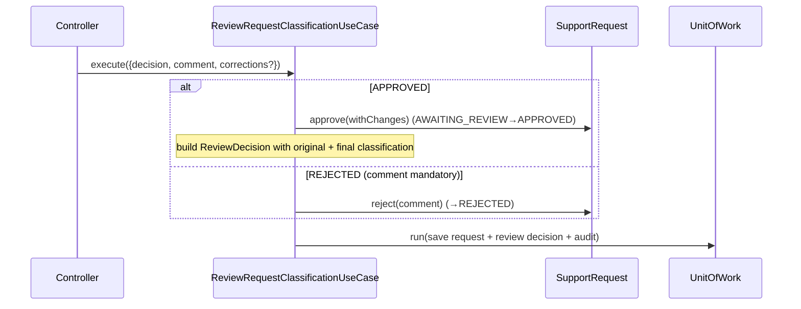

# FlowReview — Architecture

The backend follows a modular hexagonal architecture and applies Clean
Architecture's dependency rule. Domain and application code remain independent
from frameworks, persistence mechanisms and external AI providers.

## Module boundaries

Three modules, each sliced into the same layers:

```text
modules/
├── requests/   # the core capability: requests, classifications, reviews
│   ├── domain/         entities, value objects, events, errors
│   ├── application/    ports, use cases, DTOs, mappers, services
│   ├── infrastructure/ Prisma repositories, AI adapters/decorators/factory
│   └── presentation/   Express controllers/routers
├── audit/      # append-only audit trail
│   ├── domain/ application/ infrastructure/
└── users/      # demo users (NOT authentication)
    ├── domain/ application/ infrastructure/ presentation/
```

## Dependency rule



- `domain` imports nothing external (no Express/Prisma/Zod/OpenAI/env/logging).
- `application` depends only on `domain` and on its own port interfaces.
- `infrastructure` and `presentation` depend on `application` (and implement/consume its ports).
- The **composition root** wires concrete implementations with manual DI.

## Ports (driven / output)

Defined in `application`, implemented in `infrastructure`:

| Port | Responsibility | Production adapter |
| --- | --- | --- |
| `RequestRepository` | Persist/read support requests (+ list read model) | `PrismaRequestRepository` |
| `AnalysisRepository` | Persist/read classifications, keep "latest" pointer | `PrismaAnalysisRepository` |
| `ReviewRepository` | Persist/read review decisions | `PrismaReviewRepository` |
| `RequestClassifier` | Produce a classification from request text | `Fake` / `OpenAI` (+ decorators) |
| `AuditLog` | Append/read audit events | `PrismaAuditLog` |
| `UserRepository` | Read demo users | `PrismaUserRepository` |
| `UnitOfWork` | Atomic multi-aggregate write | `PrismaUnitOfWork` (`$transaction`) |
| `Clock`, `IdGenerator` | Deterministic time & ids | `SystemClock`, `UuidIdGenerator` |

## Driving (input) side

HTTP routers call use cases through the `AppContainer`:

```text
GET    /api/health
GET    /api/users
POST   /api/requests
GET    /api/requests
GET    /api/requests/:requestId
POST   /api/requests/:requestId/classify
POST   /api/requests/:requestId/review
POST   /api/requests/:requestId/retry
GET    /api/requests/:requestId/audit-log
```

## Domain model



`SupportRequest` is the aggregate root and the only place status transitions are
decided. `confidenceScore` is a value object constrained to `[0, 1]`.

## Workflow state machine



## Flow: a classification



The external classifier call happens **outside** the transaction; only the final
outcome is persisted, so a request is never left stuck in `ANALYSING`.

## Flow: a review



## Routing policy (Strategy)

After a classification, `ConfidenceAwareRoutingStrategy` decides the destination:
low confidence → `GENERAL_SUPPORT` for triage; otherwise the proposed department;
`URGENT` priority is flagged for prominent review. Routing is **derived on read**
from the latest classification — it is not persisted separately (a deliberate
trade-off to avoid duplicated state).

## Error strategy

| Kind | Where | HTTP |
| --- | --- | --- |
| Input validation (`ZodError`) | presentation | 400 |
| Missing actor / route param (`HttpError`) | presentation | 400 |
| `NotFoundError` | application | 404 |
| `InvalidStateTransitionError` | domain | 409 |
| Other `DomainError` (e.g. rejection without comment) | domain | 422 |
| Classifier errors | infrastructure → handled by use case | recorded as `CLASSIFICATION_FAILED` |
| Unexpected | — | 500 (no stack leaked in production) |

Classifier errors form a taxonomy: `Transient` (retryable), `Permanent` and
`InvalidClassifierResponse` (not retryable). Only transient errors are retried by
the `RetryingRequestClassifierDecorator`.

## Testing strategy

| Layer | Tooling | What |
| --- | --- | --- |
| Domain | Vitest | transitions, approve/approve-with-changes, reject, confidence range, terminal state |
| Application | Vitest + in-memory adapters | create, classify (success/fail), persistence, audit, review, retry, not-found |
| Infrastructure | Vitest | fake classifier, factory, retry/logging decorators, OpenAI adapter (fake client), Prisma mappers |
| Integration | Vitest + PostgreSQL | real Prisma repositories + unit of work, full cycles, analyses preserved across retry |
| HTTP | Vitest + Supertest | create, classify, approve, reject, validation, 404, 409 |

Coverage thresholds are enforced for the `domain` and `application` layers.
